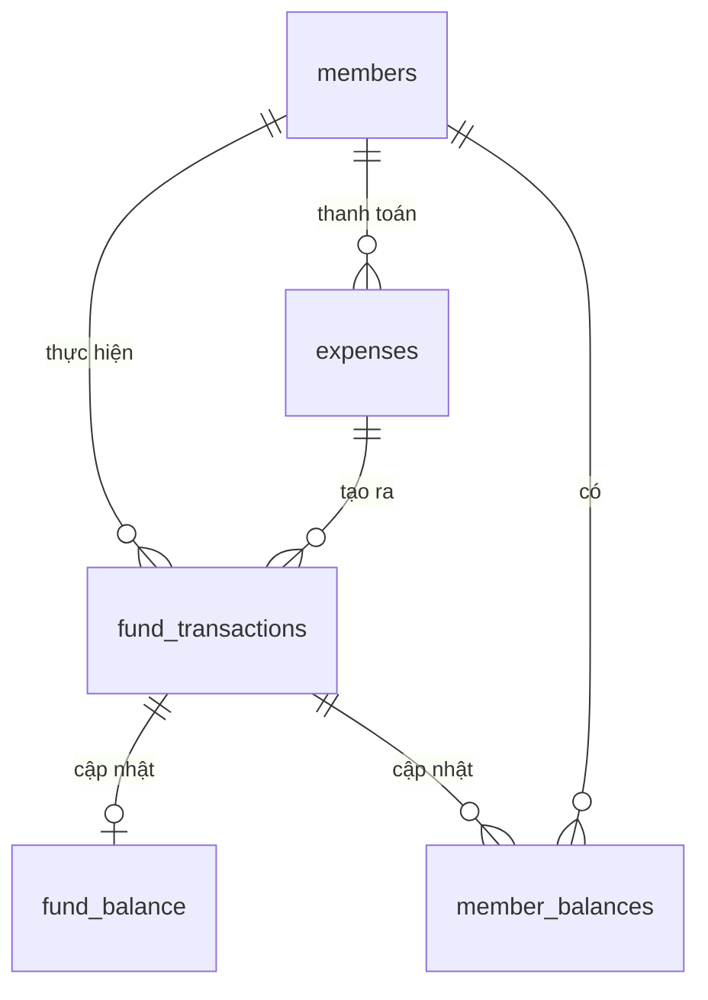
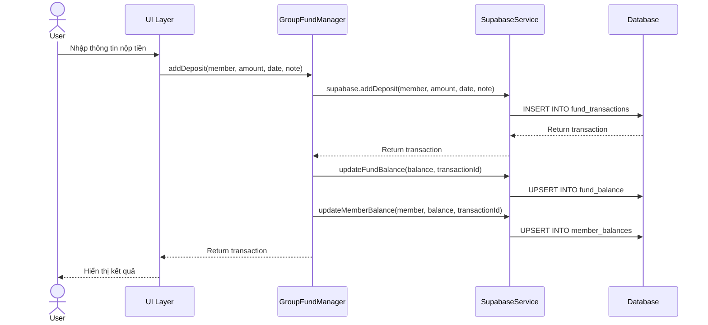
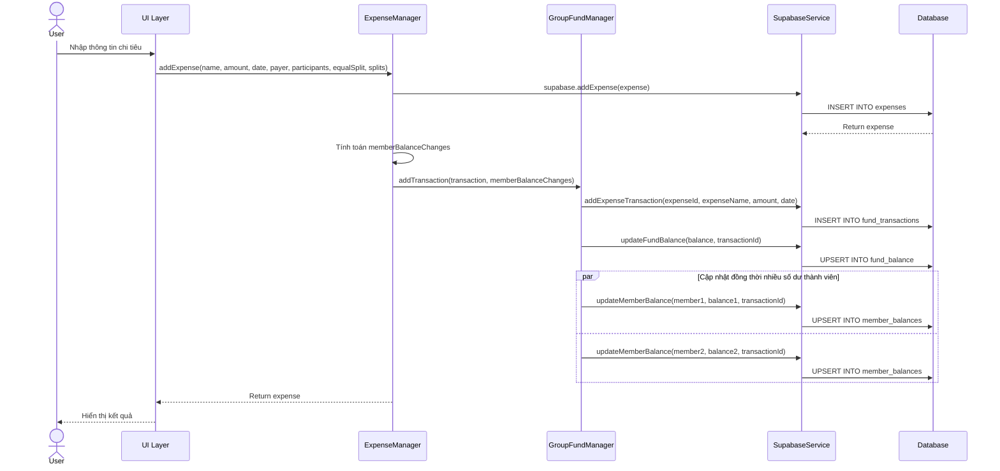

# Đặc tả kỹ thuật: Luồng nộp tiền và chi tiêu trong CafeThu6

## Thiết kế cơ sở dữ liệu

### Cấu trúc các bảng

#### 1. Bảng `members`
```
members
├── name (TEXT, PRIMARY KEY) - Tên thành viên
├── bank_account (TEXT) - Số tài khoản ngân hàng
└── role (TEXT) - Vai trò (member, admin)
```

#### 2. Bảng `fund_transactions`
```
fund_transactions
├── id (UUID, PRIMARY KEY) - ID giao dịch
├── type (TEXT) - Loại giao dịch: 'deposit' hoặc 'expense'
├── amount (INTEGER) - Số tiền giao dịch
├── date (DATE) - Ngày giao dịch
├── member (TEXT) - Thành viên liên quan (nộp tiền/thanh toán)
├── note (TEXT) - Ghi chú
├── expense_id (UUID) - ID chi tiêu liên quan (nếu có)
└── expense_name (TEXT) - Tên chi tiêu liên quan (nếu có)
```

#### 3. Bảng `expenses`
```
expenses
├── id (UUID, PRIMARY KEY) - ID chi tiêu
├── name (TEXT) - Tên chi tiêu
├── amount (INTEGER) - Tổng số tiền chi tiêu
├── date (DATE) - Ngày chi tiêu
├── payer (TEXT) - Người thanh toán
├── participants (TEXT[]) - Danh sách người tham gia
├── equal_split (BOOLEAN) - Chia đều hay không
└── splits (JSONB) - Chi tiết phân chia nếu không chia đều
```

#### 4. Bảng `fund_balance`
```
fund_balance
├── id (UUID, PRIMARY KEY) - ID
├── current_balance (INTEGER) - Số dư hiện tại của quỹ
├── last_transaction_id (UUID) - ID giao dịch gần nhất
├── last_updated (TIMESTAMP) - Thời gian cập nhật gần nhất
└── version (INTEGER) - Phiên bản (để kiểm soát đồng thời)
```

#### 5. Bảng `member_balances`
```
member_balances
├── id (UUID, PRIMARY KEY) - ID
├── member_name (TEXT) - Tên thành viên
├── current_balance (INTEGER) - Số dư hiện tại
├── last_transaction_id (UUID) - ID giao dịch gần nhất
├── last_updated (TIMESTAMP) - Thời gian cập nhật gần nhất
├── notification_threshold (INTEGER) - Ngưỡng cảnh báo
├── notified_at (TIMESTAMP) - Thời gian thông báo gần nhất
└── version (INTEGER) - Phiên bản
```

### Mối quan hệ giữa các bảng



## Luồng nộp tiền vào quỹ

### Tổng quan luồng



### Chi tiết các bước

1. **Người dùng nhập thông tin nộp tiền**
   - Thành viên nộp: `{member_name}`
   - Số tiền: `{amount}`
   - Ngày: `{date}`
   - Ghi chú (tùy chọn): `{note}`

2. **UI gọi đến GroupFundManager**
   ```javascript
   const transaction = await fundManager.addDeposit(member, amount, date, note);
   ```

3. **GroupFundManager gọi SupabaseService để tạo giao dịch**
   ```javascript
   // Tạo transaction trong bảng fund_transactions
   const savedTransaction = await supabase.addDeposit(member, amount, date, note);
   ```

4. **Cập nhật số dư quỹ**
   ```javascript
   // Cập nhật balance trong bộ nhớ
   this.balance += amount;
   
   // Cập nhật balance trong DB
   await supabase.updateFundBalance(this.balance, transaction.id);
   ```

5. **Cập nhật số dư thành viên**
   ```javascript
   // Cập nhật balance trong bộ nhớ
   this.memberBalances[member] = (this.memberBalances[member] || 0) + amount;
   
   // Cập nhật balance trong DB
   await supabase.updateMemberBalance(member, this.memberBalances[member], transaction.id);
   ```

### API Details: `addDeposit`

```javascript
async function addDeposit(member, amount, date, note = '') {
    const { data, error } = await supabase
        .from('fund_transactions')
        .insert([{
            type: 'deposit',
            amount: amount,
            date: date,
            member: member,
            note: note
        }])
        .select();
    
    if (error) throw error;
    return data[0];
}
```

### API Details: `updateFundBalance`

```javascript
async function updateFundBalance(newBalance, transactionId) {
    // Làm tròn số dư thành số nguyên
    const balanceAsInteger = Math.round(newBalance);
    
    const { data, error } = await supabase
        .from('fund_balance')
        .upsert({
            current_balance: balanceAsInteger,
            last_transaction_id: transactionId,
            last_updated: new Date().toISOString()
        }, {
            onConflict: 'id'
        })
        .select();
    
    if (error) throw error;
    return data;
}
```

### API Details: `updateMemberBalance`

```javascript
async function updateMemberBalance(memberName, newBalance, transactionId) {
    // Làm tròn số dư thành số nguyên
    const balanceAsInteger = Math.round(newBalance);
    
    const { data, error } = await supabase
        .from('member_balances')
        .upsert({
            member_name: memberName,
            current_balance: balanceAsInteger,
            last_transaction_id: transactionId,
            last_updated: new Date().toISOString()
        }, {
            onConflict: 'member_name'
        })
        .select();
    
    if (error) throw error;
    return data;
}
```

## Luồng chi tiêu

### Tổng quan luồng



### Chi tiết các bước

1. **Người dùng nhập thông tin chi tiêu**
   - Tên chi tiêu: `{name}`
   - Số tiền: `{amount}`
   - Ngày: `{date}`
   - Người trả: `{payer}`
   - Người tham gia: `{participants[]}`
   - Chia đều?: `{equalSplit}`
   - Chi tiết chia (nếu không chia đều): `{splits{}}`

2. **UI gọi đến ExpenseManager**
   ```javascript
   const expense = await expenseManager.addExpense(name, amount, date, payer, participants, equalSplit, splits);
   ```

3. **ExpenseManager gọi SupabaseService để lưu chi tiêu**
   ```javascript
   // Tạo expense trong bảng expenses
   const savedExpense = await supabase.addExpense(expense);
   ```

4. **Tính toán thay đổi số dư của từng thành viên**
   ```javascript
   const memberBalanceChanges = {};
   
   // Người thanh toán: tăng số dư
   memberBalanceChanges[payer] = amount;
   
   // Những người tham gia: giảm số dư
   if (equalSplit) {
       const splitAmount = amount / participants.length;
       participants.forEach(participant => {
           memberBalanceChanges[participant] = (memberBalanceChanges[participant] || 0) - splitAmount;
       });
   } else {
       Object.entries(splits).forEach(([participant, splitAmount]) => {
           memberBalanceChanges[participant] = (memberBalanceChanges[participant] || 0) - splitAmount;
       });
   }
   ```

5. **Tạo giao dịch quỹ và cập nhật số dư**
   ```javascript
   const transaction = new FundTransaction({
       type: 'expense',
       amount: amount,
       date: date,
       expenseId: savedExpense.id,
       expenseName: name
   });
   
   await fundManager.addTransaction(transaction, memberBalanceChanges);
   ```

6. **FundManager cập nhật số dư quỹ và số dư thành viên**
   ```javascript
   // Trong GroupFundManager.addTransaction:
   
   // Tạo transaction trong fund_transactions
   const savedTransaction = await supabase.addExpenseTransaction(
       transaction.expenseId,
       transaction.expenseName,
       transaction.amount,
       transaction.date
   );
   
   // Cập nhật số dư quỹ
   this.balance -= transaction.amount;
   await supabase.updateFundBalance(this.balance, transaction.id);
   
   // Cập nhật số dư thành viên
   Object.entries(memberBalanceChanges).forEach(([member, change]) => {
       this.memberBalances[member] = (this.memberBalances[member] || 0) + change;
   });
   
   // Lưu số dư thành viên vào DB
   await Promise.all(Object.entries(memberBalanceChanges).map(async ([member, change]) => {
       await supabase.updateMemberBalance(member, this.memberBalances[member], transaction.id);
   }));
   ```

### API Details: `addExpense`

```javascript
async function addExpense(expense) {
    const { data, error } = await supabase
        .from('expenses')
        .insert([{
            name: expense.name,
            amount: expense.amount,
            date: expense.date,
            payer: expense.payer,
            participants: expense.participants,
            equal_split: expense.equalSplit,
            splits: expense.equalSplit ? null : expense.splits
        }])
        .select();
    
    if (error) throw error;
    
    return {
        id: data[0].id,
        name: data[0].name,
        amount: data[0].amount,
        date: data[0].date,
        payer: data[0].payer,
        participants: data[0].participants,
        equalSplit: data[0].equal_split,
        splits: data[0].splits || {}
    };
}
```

### API Details: `addExpenseTransaction`

```javascript
async function addExpenseTransaction(expenseId, expenseName, amount, date) {
    const { data, error } = await supabase
        .from('fund_transactions')
        .insert([{
            type: 'expense',
            amount: amount,
            date: date,
            expense_id: expenseId,
            expense_name: expenseName
        }])
        .select();
    
    if (error) throw error;
    return data[0];
}
```

## Xử lý đồng thời và tính toàn vẹn dữ liệu

### Cơ chế phiên bản (version)

- Mỗi bảng `fund_balance` và `member_balances` đều có trường `version` để theo dõi phiên bản cập nhật
- Khi cập nhật, version tăng lên 1
- Giúp phát hiện và xử lý xung đột khi nhiều người dùng cập nhật cùng một lúc

### Hàm recalculate để đảm bảo tính nhất quán

- `recalculateBalance()` - Tính lại số dư quỹ từ các giao dịch
- `calculateAndUpdateMemberBalance(memberName)` - Tính lại số dư của thành viên

```javascript
async function recalculateBalance() {
    try {
        // Gọi hàm tính toán tổng số dư từ server
        const { data, error } = await supabase.rpc('calculate_fund_balance');
        
        if (error) {
            console.error('Lỗi khi tính toán số dư quỹ:', error);
            
            // Nếu RPC lỗi, tính thủ công
            const { data: transactions, error: txError } = await supabase
                .from('fund_transactions')
                .select('type, amount');
                
            if (txError) throw txError;
            
            // Tính toán số dư từ các giao dịch
            const balance = transactions.reduce((sum, tx) => {
                if (tx.type === 'deposit') return sum + tx.amount;
                if (tx.type === 'expense') return sum - tx.amount;
                return sum;
            }, 0);
            
            // Cập nhật số dư
            const { data: updateResult, error: updateError } = await supabase
                .from('fund_balance')
                .update({ 
                    current_balance: Math.round(balance),
                    last_updated: new Date().toISOString()
                })
                .eq('id', '...'); // ID của fund_balance
                
            if (updateError) throw updateError;
            
            return Math.round(balance);
        }
        
        // Cập nhật số dư với giá trị tính toán từ server
        const { data: updateResult, error: updateError } = await supabase
            .from('fund_balance')
            .update({ 
                current_balance: data,
                last_updated: new Date().toISOString()
            })
            .eq('id', '...'); // ID của fund_balance
            
        if (updateError) throw updateError;
        
        return data;
    } catch (error) {
        console.error('Lỗi khi tính toán lại số dư quỹ:', error);
        throw error;
    }
}
```

## Lưu ý kỹ thuật

1. **Chuyển đổi kiểu dữ liệu**
   - Số tiền lưu trong DB dưới dạng INTEGER (số nguyên)
   - Cần làm tròn số khi cập nhật: `Math.round(newBalance)`

2. **Xử lý lỗi**
   - Tất cả API calls đều có try/catch để xử lý lỗi
   - Lỗi được ghi log và ném ra để UI xử lý

3. **Tối ưu hiệu năng**
   - Sử dụng `Promise.all()` khi cập nhật nhiều số dư thành viên cùng lúc
   - Sử dụng cache trong bộ nhớ để giảm số lượng API calls

4. **Đảm bảo tính nhất quán**
   - Các hàm recalculate để đồng bộ lại dữ liệu khi cần
   - Sử dụng giao dịch (transaction) trong DB nếu có thể 